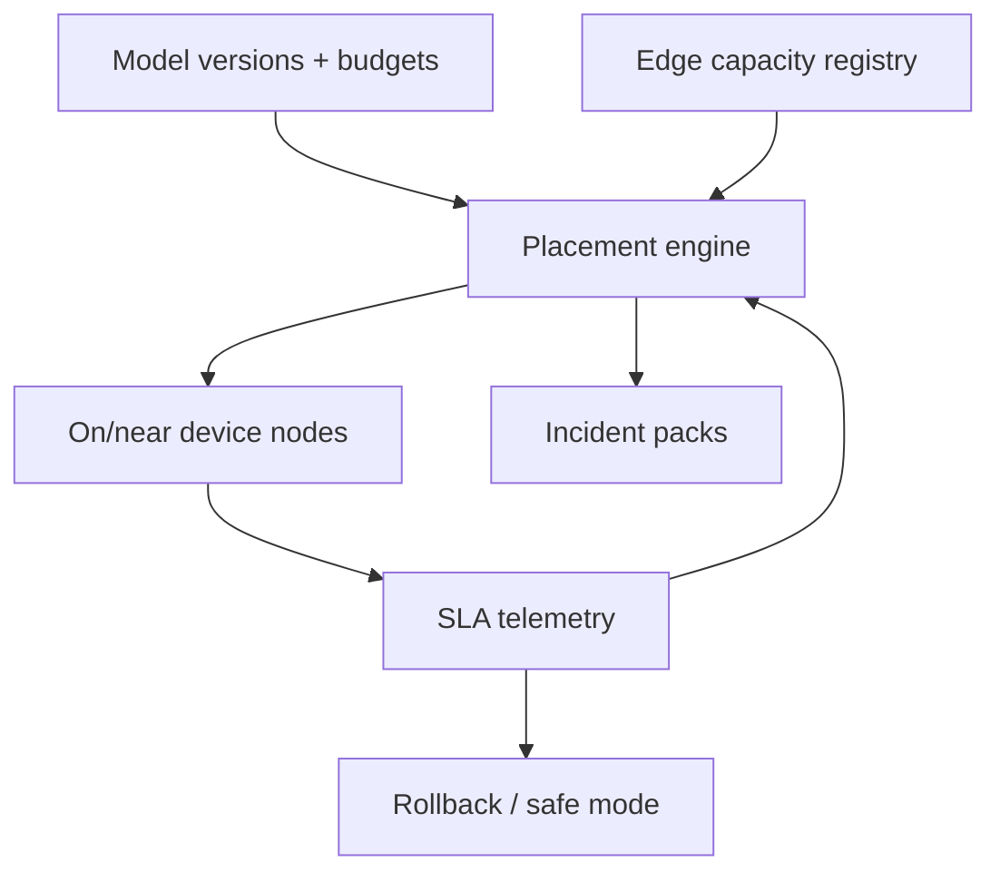

# Rimcast

**Source:** `ai-in-decentralized+ai/decentralizedai-iotconf-190117170353/`
**Domain:** `ai-decentralized`
**One-liner:** A latency-aware edge inference placement console that pins AI models to on/near-device compute so real-time IoT and physical-world agents are not stuck waiting on centralised cloud round-trips.
**Wedge:** IoT and industrial AI teams whose models work in the lab but fail SLAs in the field — hospitals, factories, and vehicle/edge fleets cited in the deck’s latency challenge — starting with one real-time inference path per site.
**Positioning:** IoTConf DeepCloud thesis. The January 2019 IoT conference deck adds a fifth problem the Boston talk lacked: Latency — “Centralized AI is inappropriate where AI needs to interact in real time with the real world,” requiring compute on or close to edge devices, with cancer-treatment-centre federated training as a motivating FL example and DeepCloud pitched at Expo 280. Rimcast productises edge placement for inference latency — distinct from Shapemint (influence incentives), Tierfog (multi-protocol federated analytics fabric), and Privybudget (privacy budgets).

## Market research synthesis

### Thesis from source

The IoTConf deck repeats the closed-source-1990s critique and the Privacy / Influence / Economic / Transparency grid, then elevates Latency as the conference-specific thesis: slow inference breaks real-time interaction with the physical world; the remedy is compute on or near edge devices, democratising cloud resources for providers and application developers (DeepCloud AI). Federated AI is illustrated with cancer treatment centres training models locally — a reminder that sensitive domains both need FL and cannot tolerate naive centralisation. Marketplace and data-exchange slides remain, but the Expo call-to-action is edge capacity, not weekly competitions.

Commercially, the beachhead is not “another edge Kubernetes” but an operations product that decides *where* a model version may run, measures end-to-end inference latency against a real-time SLA, and fails closed when placement cannot meet the physical-world interaction budget. Rimcast is that placement and SLA desk.

### Buyer & economic model

- **Primary buyer:** Head of Edge / IoT Platform or Clinical/Industrial AI lead accountable for real-time inference SLAs.
- **Users:** ML engineers, site reliability / edge ops, device fleet managers, clinical or plant safety officers, capacity planners.
- **Budget owner / value metric:** share of inferences meeting real-time SLA and cost per SLA-compliant inference versus cloud-only baseline.
- **Competing status quo:** centralised GPU cloud inference with VPN backhaul, plus ad-hoc on-device models with no placement policy or latency accounting.

### Domain constraints

- **Regulatory / trust / safety:** healthcare and industrial settings require fail-safe behaviour when edge capacity is insufficient; model versions must be controlled; audit of what ran where matters after incidents.
- **Data sensitivity:** edge sites often hold the only lawful copy of local data (cancer centres); placement must prefer local inference and minimise raw data egress.
- **Change-management realities:** sites will not rip out existing device agents; Rimcast orchestrates placement metadata and health checks beside incumbent runtimes.

## Business requirements

- BR-1: Every production model version must declare a maximum end-to-end inference latency budget for real-time use cases before it may be placed.
- BR-2: The platform must place or refuse placement based on measured edge capacity and network RTT, not aspirational topology diagrams.
- BR-3: When no placement meets the latency budget, the system must fail closed or degrade to a documented safe mode — never silently route to a slow central cloud.
- BR-4: Placement decisions must prefer on/near-device compute for real-time paths, with cloud used only when explicitly allowed as non-real-time overflow.
- BR-5: Site-local data egress for inference must be minimised and purpose-tagged, honouring federated/sensitive-site constraints (e.g. treatment centres).
- BR-6: Operators must see live SLA compliance by site, model, and device class.
- BR-7: Model rollouts to edge must be versioned with instant rollback when latency or error budgets breach.
- BR-8: Capacity providers (edge hosts) must publish available compute so placement is a market of real resources, aligned with the deck’s democratised cloud pitch.
- BR-9: Incident packs must show which model version ran on which edge node for a given physical-world event window.
- BR-10: Federated training coordination may be linked, but Rimcast’s beachhead KPI is inference latency, not training round completion.
- BR-11: Safety officers must be able to freeze placements for a site without deleting audit history.
- BR-12: Commercial terms for edge capacity (if multi-provider) must disclose price per compliant inference or per reserved slot.

## User stories

Canonical user stories live in sibling [USER_STORIES.md](USER_STORIES.md).

## System design

### Overview

Rimcast maintains a catalogue of model versions with latency budgets, a registry of edge nodes/capacity providers, and a placement engine that assigns inference endpoints only when measured capacity and RTT satisfy the budget. Telemetry continuously scores SLA compliance; breaches trigger rollback or safe mode. Optional hooks notify federated training schedulers, but the core loop is place → infer → measure → remediate.

### Actors & boundaries

- **Actors:** ML engineers, site/fleet ops, capacity providers, safety officers, compliance, platform operator.
- **Trust boundary:** placement and SLA telemetry are central; model weights may be distributed to edges; raw site data stays local unless overflow is approved.
- **Human-in-the-loop points:** safe-mode overrides, site freezes, capacity pricing approval, overflow exceptions.

### Core capabilities

1. **Model latency budgeting** — declare real-time eligibility rules.
2. **Edge capacity registry** — nodes, device classes, published supply.
3. **Placement engine** — assign or refuse based on measured feasibility.
4. **SLA telemetry** — live compliance by site/model/device.
5. **Rollback and safe mode** — automatic and operator-driven remediation.
6. **Incident evidence packs** — version × node × time window.
7. **Capacity commercial terms** — optional multi-provider pricing.
8. **Governance freezes** — site-level placement locks.

### Conceptual data

- **Primary entities:** ModelVersion, LatencyBudget, EdgeNode, CapacityOffer, Placement, SlaSample, IncidentPack, SafeModeEvent.
- **Critical events:** budget set, capacity published, placement accepted/refused, SLA breach, rollback, site freeze.
- **Retention / audit needs:** placement and SLA history for safety and contractual windows; local inference logs retained per site policy.

### Integrations (conceptual)

- **Systems of record:** device management (MDM/IoT), model registries, site identity providers.
- **Upstream signals:** node health, RTT probes, GPU/CPU utilisation, federated round schedulers (optional).
- **Downstream actions:** model push to edge runtimes, traffic steering, alert to safety ops, capacity invoices.

### High-level architecture

### Success metrics

- **Leading:** placement refusal rate for infeasible real-time asks; median inference latency vs budget; time-to-rollback after breach.
- **Lagging:** SLA compliance share; cloud-overflow rate on real-time paths; incident rate attributable to slow inference; capacity provider utilisation.

## OpenAPI skeleton

Canonical HTTP surface lives in sibling [openapi.yaml](openapi.yaml). Summary:

- **Base path:** `/v1/...`
- **Auth:** `X-API-Key` for edge agents; Bearer JWT for operators.
- **Resource groups:** Models, Capacity, Placements, Telemetry, Incidents, Governance.
