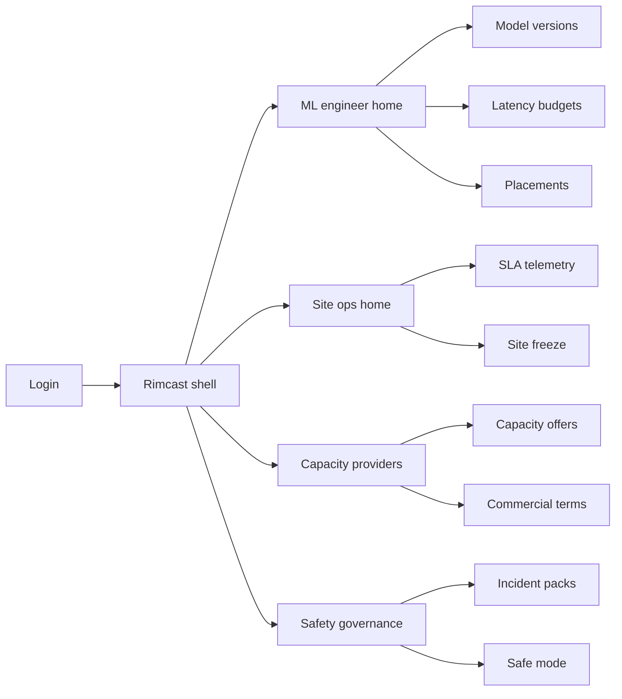
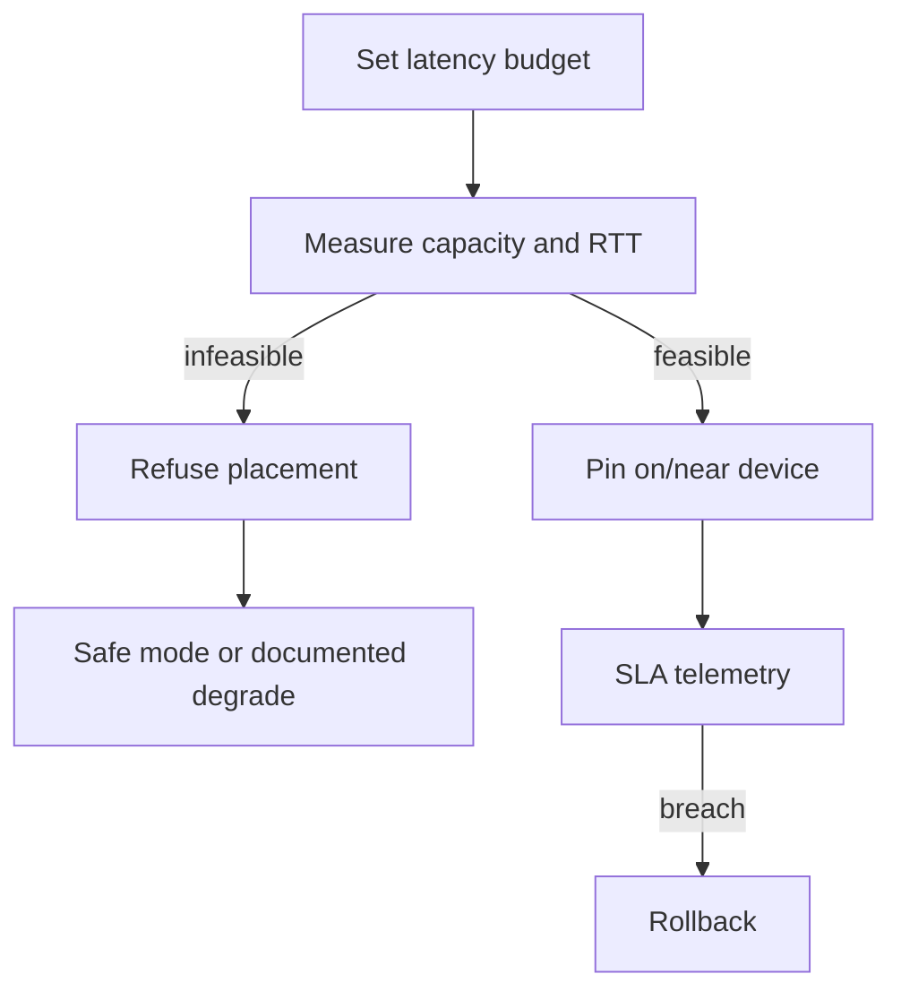

# Rimcast — Web app

**Product:** [PRODUCT.md](./PRODUCT.md)
**Primary surface:** Edge inference placement and SLA console (ML platform + site ops under one Rimcast shell)
**Secondary surfaces:** Capacity provider portal (publish compute/price); incident pack export for safety review
**Design thesis:** Rimcast is a placement desk for physical-world inference — not a generic Kubernetes fleet dashboard. The UI metaphor is a rim of edge nodes around a latency clock: models only pin when measured RTT and capacity fit the real-time budget; silent cloud backhaul is treated as a failure mode, not a convenience. Visual language is cool industrial graphite with SLA-green for compliant inference and latency-amber/coral for breach and safe mode. The brand wordmark sits as a quiet rim mark on every placement and incident screen so clinical and plant operators know whose latency gate they are trusting.

## UX research synthesis

### Category peers (best-in-class)

- **AWS IoT Greengrass / Azure IoT Edge:** Device-local runtime, model deploy to edge. Steal: versioned push to on/near-device; reject cloud-first defaults that hide round-trip cost.
- **NVIDIA Fleet Command / Edge Orchestrator:** GPU fleet placement, health, rollout. Steal: measured capacity before place; reject aspirational topology maps as “placed.”
- **Datadog / Grafana SLO consoles:** Live SLO burn, error budgets, rollback cues. Steal: SLA compliance by site/model/device class as home chrome; reject vanity uptime that ignores inference latency budgets.
- **Balena / device fleet managers:** Pin releases, instant rollback, site freezes. Steal: one-click rollback and site freeze without deleting history; reject hobby IoT aesthetics for hospital/factory density.

### Patterns to adopt / reject

- **Adopt:** Latency budget required before place; refuse when infeasible; fail closed / documented safe mode; prefer on/near-device; live SLA by site; incident pack (version × node × window); capacity offers with disclosed price; egress purpose tags.
- **Reject:** Silent cloud overflow for “real-time”; purple edge-AI glow; training-round dashboards as home (BR-10); editable placement history; aspirational-only topology.

### Trust, density, and workflow constraints from PRODUCT.md

Every production version needs a max E2E latency budget (BR-1). Placement uses measured capacity and RTT (BR-2). Infeasible asks fail closed or safe-mode — never silent slow cloud (BR-3, BR-4). Site-local data egress minimised and purpose-tagged (BR-5). Live SLA by site/model/device (BR-6). Versioned rollout with instant rollback (BR-7). Capacity providers publish real supply (BR-8). Incident packs for after-action (BR-9). Site freeze without deleting audit (BR-11). Multi-provider commercial terms disclosed (BR-12).

## Information architecture

### Nav model

### Roles → default home

| Role | Default home | Why |
|------|--------------|-----|
| ML / edge platform engineer | Placements + budgets | Real-time eligibility (BR-1, BR-2) |
| Site / fleet operator | SLA telemetry | Physical-world readiness (BR-6) |
| Capacity provider | Capacity offers | Democratised supply (BR-8, BR-12) |
| Safety / clinical governance | Incident packs + freeze | After-action + halt (BR-9, BR-11) |
| Compliance | Egress purpose tags / history | Overflow accountability (BR-5) |

### Cross-links to OpenAPI resources

| Nav area | OpenAPI tags / resources |
|----------|---------------------------|
| Versions and latency budgets | Models |
| Edge nodes and offers | Capacity |
| Place / refuse decisions | Placements |
| SLA samples | Telemetry |
| Evidence packs | Incidents |
| Freezes and safe mode | Governance |

## Screen inventory

### ML engineer home

- **Purpose:** Answer “which versions are real-time eligible and where are they pinned?” in one composition.
- **Entry:** Engineer login default.
- **Layout regions:** Brand + site/fleet switcher; budget compliance strip; placement map (edge vs refused); rollback alerts; overflow exceptions (explicit only).
- **Primary actions:** Set budget; request placement; rollback version.
- **Empty / loading / error:** Empty = register first model version + budget; error = agent heartbeat lost.
- **BR / story ties:** BR-1, BR-2, BR-7.

### Latency budget editor

- **Purpose:** Declare max E2E inference latency before a version may be placed for real-time use.
- **Entry:** Model version detail.
- **Layout regions:** Budget form (ms); real-time vs non-real-time overflow allow flag; measurement definition (client→result); validation against recent probes.
- **Primary actions:** Save budget; simulate placement feasibility.
- **Empty / loading / error:** Missing budget blocks place CTA.
- **BR / story ties:** BR-1, BR-4.

### Placement desk

- **Purpose:** Assign or refuse based on measured capacity and RTT — not aspirational diagrams.
- **Entry:** Engineer nav → Placements.
- **Layout regions:** Candidate nodes with measured RTT/capacity; accept/refuse decision; preference order on/near-device; cloud overflow only if explicitly allowed and labelled non-real-time.
- **Primary actions:** Place; refuse with reason; pin device class.
- **Empty / loading / error:** No feasible node = fail-closed coral state with safe-mode options.
- **BR / story ties:** BR-2, BR-3, BR-4.

### SLA telemetry

- **Purpose:** Live compliance by site, model, and device class.
- **Entry:** Site ops default.
- **Layout regions:** Site heatmap; burn charts vs budget; device class breakdown; breach list.
- **Primary actions:** Open breach; trigger rollback; freeze site.
- **Empty / loading / error:** No samples = instrumentation setup; stale telemetry = amber.
- **BR / story ties:** BR-6.

### Capacity offers

- **Purpose:** Providers publish real compute and price for placement markets.
- **Entry:** Capacity provider home.
- **Layout regions:** Node inventory; available slots; price per compliant inference or reserved slot; health probes.
- **Primary actions:** Publish offer; update price; withdraw capacity.
- **Empty / loading / error:** Unhealthy node auto-withdraws from placement pool.
- **BR / story ties:** BR-8, BR-12.

### Rollback and safe mode

- **Purpose:** Instant rollback on latency/error breach; documented degrade — never silent slow cloud.
- **Entry:** Breach alert; governance.
- **Layout regions:** Active placements; prior version; safe-mode playbook; acknowledgment log.
- **Primary actions:** Rollback; enter safe mode; clear after review.
- **Empty / loading / error:** Safe mode banner on all site screens.
- **BR / story ties:** BR-3, BR-7.

### Site freeze

- **Purpose:** Safety officers freeze placements without deleting audit history.
- **Entry:** Safety home; incident flow.
- **Layout regions:** Freeze controls per site; affected placements; immutable history still queryable.
- **Primary actions:** Freeze/unfreeze; notify engineers.
- **Empty / loading / error:** Frozen site rejects new places.
- **BR / story ties:** BR-11.

### Incident packs

- **Purpose:** Show which model version ran on which edge node for a physical-world event window.
- **Entry:** Safety default; breach deep link.
- **Layout regions:** Time window picker; version × node timeline; SLA samples; egress tags if any overflow.
- **Primary actions:** Generate pack; export; attach to case.
- **Empty / loading / error:** No placements in window.
- **BR / story ties:** BR-9, BR-5.

### Egress and overflow policy

- **Purpose:** Minimise site-local data egress; purpose-tag any allowed cloud overflow.
- **Entry:** Compliance nav.
- **Layout regions:** Policy per site; purpose tags; real-time path must not use overflow; audit of overflow events.
- **Primary actions:** Approve exception; revoke; export.
- **Empty / loading / error:** Unpurpose-tagged overflow blocked.
- **BR / story ties:** BR-5.

## Key flows

1. **Budget → place → measure** — set latency budget → measure capacity/RTT → place or refuse → telemetry; failure: refuse + safe mode, no silent cloud.

2. **Breach remediation** — SLA breach → rollback or safe mode → incident pack (BR-7, BR-9).

3. **Site freeze** — safety freeze → block new places → history retained (BR-11).

4. **Capacity publish** — provider publishes slots + price → enters placement pool when healthy (BR-8, BR-12).

5. **Overflow exception** — non-real-time only → purpose tag → compliance audit (BR-4, BR-5).

## Design system

### Tokens (CSS variables)

- `--color-ink: #E7EDF3` — primary text
- `--color-graphite-950: #0A1016` — app ground
- `--color-graphite-900: #131B24` — panels
- `--color-graphite-700: #2A3848` — dividers
- `--color-sla: #3DBF8C` — compliant inference
- `--color-sla-dim: #1A6B4E` — sla on dark
- `--color-amber: #E0A04A` — approaching budget
- `--color-coral: #E85D4C` — breach / refuse / freeze
- `--color-steel: #7A90A4` — secondary labels
- `--color-brand: #9FCBB8` — Rimcast wordmark
- `--font-display: "IBM Plex Sans", sans-serif`
- `--font-mono: "IBM Plex Mono", monospace` — node ids, version hashes, latency ms
- `--space-1`…`--space-8`: 4px scale
- `--radius-sm: 4px`; `--radius-md: 6px` — industrial panel, not soft consumer
- `--motion-place: 180ms ease-out` — pin confirm
- `--motion-breach: 220ms ease-in-out` — coral breach pulse
- `--motion-freeze: 200ms ease-in` — freeze banner
- Atmosphere: subtle concentric “rim” rings behind placement map; cool industrial vignette — not purple IoT neon.

### Typography & brand

- Display for latency numerals and site titles; mono for version digests, node ids, ms budgets.
- Brand wordmark on placement, SLA, and incident screens.
- Login: brand hero; headline (“Pin inference where the world can’t wait”); one CTA.

### Do / don’t

- **Do:** Require budgets; refuse infeasible real-time; prefer edge; show version×node in incidents; disclose capacity price.
- **Don’t:** Silent cloud for real-time; training KPI as home; editable history; purple glow.

### Accessibility & domain trust cues

- AA+ contrast; breach/freeze never colour-only.
- Live regions for SLA breach and site freeze.
- Focus: budget → place → telemetry → incident.

## Component patterns

- **LatencyBudgetBadge** — max E2E ms required for real-time eligibility.
- **PlacementFeasibilityRow** — measured RTT/capacity accept or refuse.
- **FailClosedBanner** — no silent slow cloud.
- **SlaSiteHeatmap** — compliance by site/model/device.
- **EdgePreferChip** — on/near-device before any overflow.
- **IncidentVersionNodeTimeline** — what ran where in a window.
- **SiteFreezeControl** — halt placements, keep audit.
- **CapacityPriceLine** — disclosed per compliant inference/slot.

## Out of scope for v1 web

- Full federated training orchestrator as primary product (BR-10); influence incentive mint (Shapemint); sealed competition desk (Cipherquest); replacing device agent runtimes; consumer smart-home app; VR/AR headset clients.
